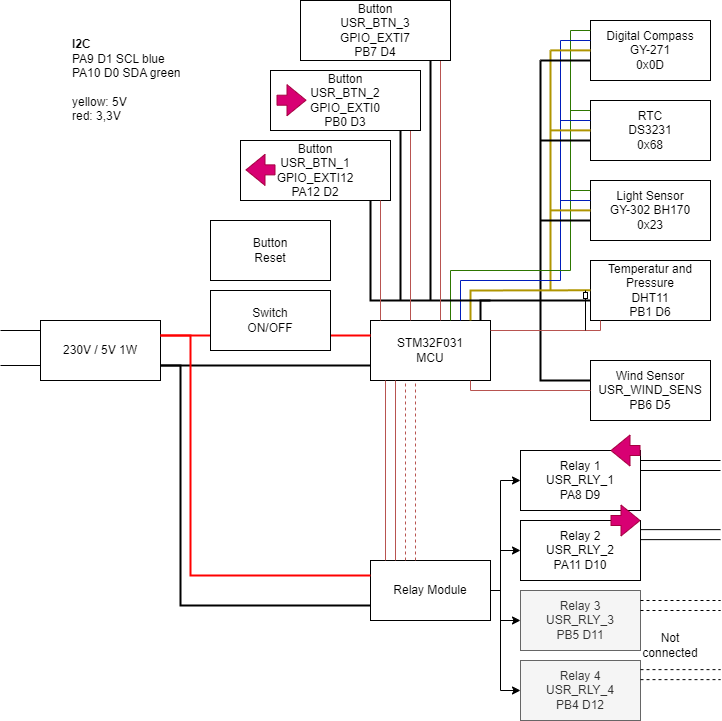

# sun_follower
Digital compass controlled sun follower for PV modules.



This project provides firmware for a device that aligns a PV installation with the sun.  
- The sun's position is calculated, and the orientation of the panel is measured using a magnetic field sensor (digital compass).  
- Relays are used to drive an actuator (e.g., motor) that adjusts the PV panel's position.  
- A Real-Time Clock (RTC) module ensures that date and time are accurate for calculating the sun’s position.  
- A light sensor is planned to determine whether the sun is actually shining.  
- There are also planned sensors for temperature, air pressure, and wind speed, though they are not yet integrated.  

Currently, only the digital compass and the RTC module are operational. In the `python` folder, you will find a script that reads and processes the compass data. Note that the compass must be calibrated for accurate readings.

In the `doc` folder, you can find datasheets for the various components and a block diagram of the system.

---

## Requirements

1. **Arm GNU Toolchain (arm-none-eabi)**  
   - You need a GCC-based toolchain for ARM (e.g., [Arm GNU Toolchain](https://developer.arm.com/tools-and-software/open-source-software/developer-tools/gnu-toolchain/gnu-rm)) installed and accessible in your system’s PATH.  
   - Verify by running:  
     ```bash
     arm-none-eabi-gcc --version
     ```
2. **CMake**  
   - Make sure you have CMake installed (minimum version depends on your project requirements).  
   - Verify by running:  
     ```bash
     cmake --version
     ```
3. **Ninja**  
   - Install [Ninja](https://ninja-build.org/) as the build system.  
   - Verify by running:  
     ```bash
     ninja --version
     ```
4. **ST-Link Tool for Flashing**
	To flash the firmware to your device, you need the ST-Link tool.
	On Windows, download and use the version `stlink-1.7.0-x86_64-w64-mingw32.zip`.

---

## How to Configure and Build

1. **Clone or download** this repository, and ensure you have the correct branch checked out.  
2. **Check/modify the toolchain file**  
   - The file `gcc-arm-none-eabi.cmake` (or a similar name) should point to your ARM toolchain if needed.  
3. **Create a build directory**  
   - From the root of the project, create and enter a new `build` folder:  
     ```bash
     mkdir build
     cd build
     ```
4. **Configure with CMake**  
   - In your new `build` directory, run:  
     ```bash
     cmake -G "Ninja" ..
     ```
   - This tells CMake to use Ninja as the generator.
5. **Build the project**  
   - Still inside the `build` directory, run:  
     ```bash
     cmake --build .
     ```
   - Or simply:  
     ```bash
     ninja
     ```
6. **Result**  
   - After a successful build, you should find the firmware output files (e.g., `.elf`, `.hex`, `.bin`) in your `build` folder.

---

## Converting the Project to C++

If you want to build the firmware as a C++ project instead of C, follow these steps:

1. **Specify the C++ standard in the top-level `CMakeLists.txt`**  
   ```cmake
   set(CMAKE_CXX_STANDARD 17)
   set(CMAKE_CXX_STANDARD_REQUIRED ON)
   set(CMAKE_CXX_EXTENSIONS OFF)
   ```
   This ensures all sources compiled under your main target use (at least) C++17.

2. **Suppress HAL warnings in the STM32 Drivers**  
   In the **subdirectory** (generated by CubeMX) that defines the HAL driver target (often called `stm32cubemx` or similar), add:
   ```cmake
   target_compile_options(STM32_Drivers PRIVATE
       -Wno-sign-compare
       -Wno-unused-parameter
       -Wno-missing-field-initializers
   )
   ```
   directly **after** `target_link_libraries(STM32_Drivers PUBLIC stm32cubemx)`. This prevents certain compiler warnings (common in STM32 HAL code) from polluting your build logs.

3. **Rename `main.c` to `main.cpp`**  
   - Update the filename and references (e.g., in the subdirectory `CMakeLists.txt`) so CMake knows it should be compiled as C++ source.  
   - This step will likely need to be repeated if you re-generate code with STM32CubeMX, as CubeMX typically outputs `main.c`.

4. **Add `extern "C"` around STM32 includes in `main.cpp`**  
   ```cpp
   extern "C" {
   #include "main.h"
   #include "gpio.h"
   // ... other STM32/HAL headers
   }
   ```
   This tells the C++ compiler not to use name mangling for these C-based functions, avoiding linker conflicts.
   
5. **Update structure initialization in SystemClock_Config()**
	In `main.cpp`, modify the initialization of structure variables to use Uniform-Initialization. Replace code like:
    ```cpp
	RCC_OscInitTypeDef RCC_OscInitStruct = {0};
	RCC_ClkInitTypeDef RCC_ClkInitStruct = {0};
	```
	with:

	```cpp
	RCC_OscInitTypeDef RCC_OscInitStruct{};
	RCC_ClkInitTypeDef RCC_ClkInitStruct{};
	```
	This ensures that all members are fully value-initialized and avoids warnings about missing initializers.

### Why these changes are needed

- STM32CubeMX initially sets up a **C**-based project. To use **C++** features, you must enable the C++ compiler and specify a C++ standard in your top-level CMake configuration.  
- The STM32 **HAL code** often triggers compiler warnings when using strict warning levels (`-Wall`, `-Wextra`). To keep your codebase clean, you can disable these specific warnings only for the vendor's HAL sources.  
- **Renaming `main.c` to `main.cpp`** ensures it is actually compiled with the C++ compiler, and **`extern "C"`** ensures the HAL's C functions have the correct linkage in your C++ project.

If you ever regenerate code from CubeMX, be aware that it may restore files like `main.c`; you will need to reapply the filename change and other tweaks to stay in sync with your C++ environment.
