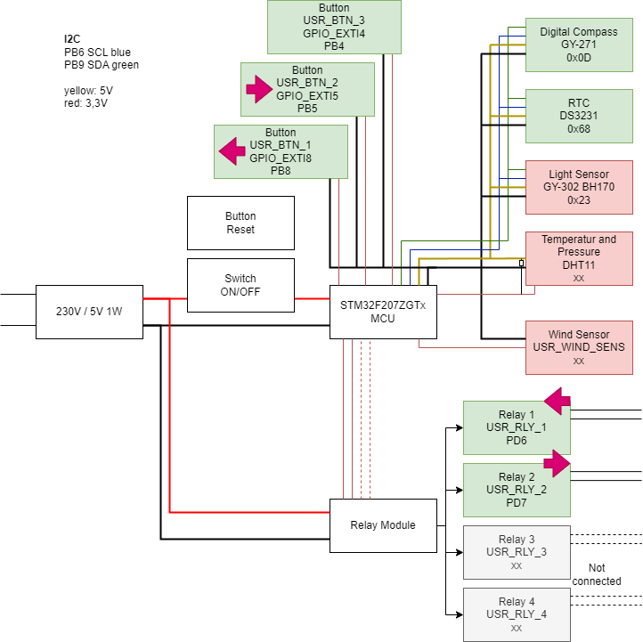

# sun_follower
Digital compass controlled sun follower for PV modules.



This project provides firmware for a device that aligns a PV installation with the sun.  
- The sun's position is calculated, and the orientation of the panel is measured using a magnetic field sensor (digital compass).  
- Relays are used to drive an actuator (e.g., motor) that adjusts the PV panel's position.  
- A Real-Time Clock (RTC) module ensures that date and time are accurate for calculating the sun’s position.  
- A light sensor is planned to determine whether the sun is actually shining.  
- There are also planned sensors for temperature, air pressure, and wind speed, though they are not yet integrated.  

Currently, only the digital compass and the RTC module are operational. In the `python` folder, you will find a script that reads and processes the compass data. Note that the compass must be calibrated for accurate readings.

In the `doc` folder, you can find datasheets for the various components and a block diagram of the system.

---

## Requirements

1. **Arm GNU Toolchain (arm-none-eabi)**  
   - You need a GCC-based toolchain for ARM (e.g., [Arm GNU Toolchain](https://developer.arm.com/tools-and-software/open-source-software/developer-tools/gnu-toolchain/gnu-rm)) installed and accessible in your system’s PATH.  
   - Verify by running:  
     ```bash
     arm-none-eabi-gcc --version
     ```
2. **CMake**  
   - Make sure you have CMake installed (minimum version depends on your project requirements).  
   - Verify by running:  
     ```bash
     cmake --version
     ```
3. **Ninja**  
   - Install [Ninja](https://ninja-build.org/) as the build system.  
   - Verify by running:  
     ```bash
     ninja --version
     ```

---

## How to Configure and Build

1. **Clone or download** this repository, and ensure you have the correct branch checked out.  
2. **Check/modify the toolchain file**  
   - The file `gcc-arm-none-eabi.cmake` (or a similar name) should point to your ARM toolchain if needed.  
3. **Create a build directory**  
   - From the root of the project, create and enter a new `build` folder:  
     ```bash
     mkdir build
     cd build
     ```
4. **Configure with CMake**  
   - In your new `build` directory, run:  
     ```bash
     cmake -G "Ninja" ..
     ```
   - This tells CMake to use Ninja as the generator.
5. **Build the project**  
   - Still inside the `build` directory, run:  
     ```bash
     cmake --build .
     ```
   - Or simply:  
     ```bash
     ninja
     ```
6. **Result**  
   - After a successful build, you should find the firmware output files (e.g., `.elf`, `.hex`, `.bin`) in your `build` folder.

---

For additional details regarding programming the device or deploying the firmware, refer to any documentation or scripts in the repository that are specific to your microcontroller or board.
